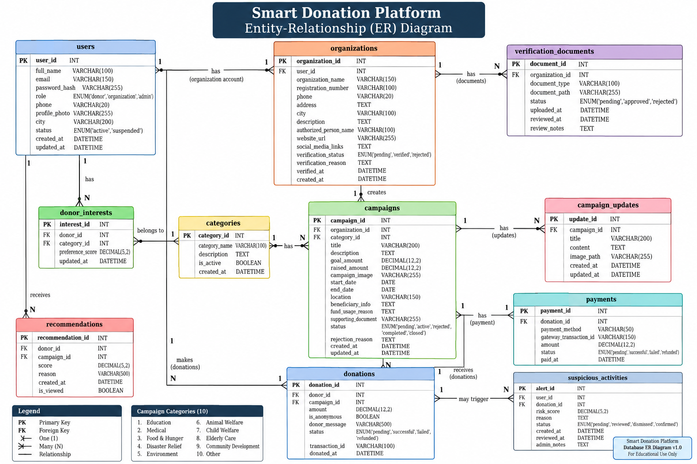

SMART DONATION PLATFORM 

* architecture of website

                 SMART DONATION PLATFORM
                         │
                         │
              ┌──────────┴──────────┐
              │                     │
              ▼                     ▼
         FRONTEND                BACKEND
      HTML + CSS + JS         Python + Flask
                                    │
                                    ▼
                                DATABASE
                              MySQL / SQLite

$ features

*** 1. user , organisation and admin registration and login (COMMON)
*** 2.Role-Based access (COMMON)
*** 3.browse campaign (ADMIN & DONOR)
*** 4.search and filtering (COMMON)
*** 5.campaign creation (ORGANIZATION)
*** 6.campaign approval (ADMIN)
*** 7.donation system (DONOR)
*** 8.donation history (COMMON)
**  9.donation receipt (DONOR)
*** 10.organization verification (ADMIN)
*   11.campaigns updates (DONAR)
*   12.smart recommendation (DONOR)
**  13.Admin analytics (ADMIN)
**  14.Suspicious activity detection (ADMIN)

$ AI features

*** 1.Personalized donation recommendation
*** 2.suspicious donation detection
*** 3.Smart donation amount suggestion

### Overall Platform Flow

🌐 Overall Platform Flow

At the highest level:

                         WEBSITE
                            │
                     ┌──────┴──────┐
                     │             │
                  REGISTER       LOGIN
                     │             │
                     └──────┬──────┘
                            ↓
                     Identify User Role
                            │
              ┌─────────────┼─────────────┐
              ↓             ↓             ↓
            DONOR      ORGANIZATION      ADMIN
              │             │             │
              ↓             ↓             ↓
          Donor         Organization    Admin
         Dashboard       Dashboard     Dashboard

Let's go through each one carefully.

###  DONOR USER FLOW

👤 1. DONOR USER FLOW

The donor is the most important public user.

A. First visit

A person visits the website:

                    HOME PAGE
                       │
          ┌────────────┼────────────┐
          ↓            ↓            ↓
      Browse       Learn More    Login/Register
      Campaigns

A visitor doesn't necessarily need an account just to browse campaigns.

That's good because it reduces friction.

B. Browse Campaigns
HOME
 ↓
EXPLORE CAMPAIGNS
 ↓
Search / Filter
 ↓
Campaign List
 ↓
Select Campaign
 ↓
Campaign Details

Campaign details show:

Campaign Name
Organization
Verification ✓
Description
Goal
Amount Raised
Progress
Days Remaining
Updates

Then:

             [ DONATE NOW ]
                    │
                    ↓
             Is user logged in?
               ↙          ↘
             YES           NO
              ↓             ↓
       Donation page    Login/Register
                            ↓
                       Donation page
💰 C. Donation Flow

Once the donor reaches the donation page:

CAMPAIGN
   ↓
DONATION PAGE
   ↓
Enter/select amount
   ↓
SMART AMOUNT SUGGESTION
   ↓
Confirm amount
   ↓
Donation confirmation
   ↓
Payment
   ↓
Success / Failure

The smart amount suggestion happens before confirmation.

For example:

┌─────────────────────────────────┐
│        Make a Donation           │
│                                  │
│ Suggested: ₹500 💡              │
│                                  │
│ [ ₹100 ] [ ₹500 ] [ ₹1000 ]     │
│                                  │
│ Other amount: [_______]          │
│                                  │
│         [ Continue ]             │
└─────────────────────────────────┘

The donor is never forced to use the suggested amount.

🧠 D. Smart Recommendation Flow

After a donor has some activity on the platform:

Donor Activity
      │
      ├── Previous Donations
      ├── Categories
      ├── Amounts
      └── Interests
             │
             ↓
       Python Smart Engine
             │
             ↓
      Recommendation Score
             │
             ↓
     Suitable Campaigns
             │
             ↓
       Donor Dashboard

The dashboard might show:

┌──────────────────────────────────────┐
│       RECOMMENDED FOR YOU 🤖         │
│                                      │
│ Education Support                    │
│ Match: 92%                           │
│ ₹35,000 / ₹50,000                    │
│                                      │
│          [ View Campaign ]           │
└──────────────────────────────────────┘
🧾 E. After Donation

After successful donation:

Donation Successful
        ↓
Generate Donation Record
        ↓
Generate Receipt
        ↓
Update Campaign Amount
        ↓
Update Donor History
        ↓
Update Analytics

The donor gets:

       ✅ Donation Successful

Campaign: Education Support
Amount: ₹500
Transaction ID: XXXXX

[ View Receipt ]
[ Download Receipt ]

And their dashboard gets updated.

👤 F. Donor Dashboard

After login:

DONOR DASHBOARD
       │
 ┌─────┼───────────────────────────┐
 ↓     ↓                           ↓
Home  My Donations            Recommendations
 │       │                           │
 │       ↓                           ↓
 │   Donation History          Suggested Causes
 │
 ├── Browse Campaigns
 ├── Profile
 └── Logout
Dashboard should contain:

Overview

Total Donated: ₹5,500
Campaigns Supported: 8

Recent Donations

Education Support     ₹500
Medical Help          ₹1000
Food Drive            ₹500

Recommendations

🤖 Recommended for you

###  ORGANIZATION FLOW

🏢 2. ORGANIZATION FLOW

Now let's design the organization side.

An organization wants to raise money.

A. Registration
Organization
      ↓
Register
      ↓
Enter Organization Details
      ↓
Upload Verification Documents
      ↓
Submit
      ↓
Pending Verification

The organization sees:

⏳ Your organization verification is pending.

🔍 B. Admin Verification

This connects the organization flow with the admin flow:

Organization
     ↓
Submit Details
     ↓
ADMIN
     ↓
Review
     │
  ┌──┴───┐
  ↓      ↓
Approve Reject
  ↓      ↓
Verified Rejected

If approved:

✓ Verified Organization

If rejected:

❌ Verification Rejected

Reason: ____________

The organization can potentially correct the information and resubmit.

📢 C. Create Campaign

Once verified:

Organization Dashboard
        ↓
Create Campaign
        ↓
Enter Campaign Details
        ↓
Upload Campaign Image
        ↓
Set Goal
        ↓
Set End Date
        ↓
Submit
        ↓
Pending Admin Approval

Again, we don't immediately publish it.

👨‍💼 D. Campaign Approval
Organization
      ↓
Campaign Submitted
      ↓
ADMIN REVIEW
      ↓
 ┌────┴────┐
 ↓         ↓
Approve   Reject
 ↓         ↓
LIVE      Rejected

If approved:

Campaign
   ↓
Published
   ↓
Visible to donors
💵 E. Organization Receives Donations

Once the campaign is live:

DONOR
   ↓
Donation
   ↓
Campaign
   ↓
Database
   ↓
Organization Dashboard

Organization can see:

Campaign: Education Support

Goal: ₹50,000
Raised: ₹32,000
Donors: 245

Progress: 64%
📢 F. Campaign Updates

Organization can post:

Campaign Dashboard
        ↓
Post Update
        ↓
Update visible
        ↓
Donors can see it

Example:

"We have provided educational materials to 75 students."

This improves transparency.

### ADMIN FLOW

👨‍💼 3. ADMIN FLOW

Now the admin is the controller of the platform.

ADMIN LOGIN
     ↓
ADMIN DASHBOARD
     │
     ├── Users
     ├── Organizations
     ├── Campaigns
     ├── Donations
     ├── Verification
     ├── Suspicious Activity
     └── Analytics
🔍 A. Organization Verification
Pending Organizations
        ↓
Select Organization
        ↓
Review Details/Documents
        ↓
     ┌──┴───┐
     ↓      ↓
  Approve  Reject
📢 B. Campaign Approval
Pending Campaigns
       ↓
Review Campaign
       ↓
Check Organization
       ↓
Check Campaign Details
       ↓
    ┌──┴───┐
    ↓      ↓
 Approve  Reject
    ↓
 Published
🚨 C. Suspicious Activity Detection

This is one of our smart features.

Every donation goes through:

Donation
   ↓
Database
   ↓
Python Detection System
   ↓
Analyze Pattern
   ↓
 ┌──────────┴──────────┐
 ↓                     ↓
Normal              Suspicious
 ↓                     ↓
Continue           Flag Activity
                       ↓
                 Admin Dashboard
                       ↓
                  Manual Review

Admin might see:

⚠️ Suspicious Activity

Campaign: XYZ
User: User123
Amount: ₹10,000

Reason:
Unusual donation pattern

[ Review ]

Again, the system flags; the admin makes the final decision.

📊 D. Admin Analytics

The admin dashboard can collect:

Users
Organizations
Campaigns
Donations
Categories

and display:

TOTAL DONATIONS
       ₹25,00,000

TOTAL DONORS
       2,450

ACTIVE CAMPAIGNS
       120

VERIFIED ORGANIZATIONS
       85

Plus charts for donation trends and categories.

### NOW CONNECT EVERYTHING

🔗 4. NOW CONNECT EVERYTHING

This is the most important diagram for your documentation.

                         SMART DONATION PLATFORM
                                   │
               ┌───────────────────┼───────────────────┐
               │                   │                   │
               ▼                   ▼                   ▼
             DONOR            ORGANIZATION           ADMIN
               │                   │                   │
               ▼                   ▼                   ▼
          Browse Causes       Register           Login
               │                   │                   │
               ↓                   ↓                   ├── Verify Organizations
        Smart Recommendation   Verification            ├── Approve Campaigns
               │                   │                   ├── Monitor Donations
               ↓                   ↓                   ├── Review Alerts
          Select Campaign     Create Campaign           └── Analytics
               │                   │
               ↓                   ↓
          Smart Amount       Admin Approval
          Suggestion              │
               │                  ↓
               ↓              Published
            Donate                 │
               │                  │
               └──────────┬───────┘
                          ↓
                    DONATION DATA
                          │
              ┌───────────┼───────────┐
              ↓           ↓           ↓
       Recommendation  Detection   Analytics
          Engine         Engine       Engine
              │           │
              ↓           ↓
           Donor       Admin Alert
       Recommendations

🧭 5. Complete user journey

Let's put everything into one simple story.

👤 Donor
Visit Website
      ↓
Browse Campaigns
      ↓
Register/Login
      ↓
View Campaign
      ↓
Get Suggested Donation Amount 💡
      ↓
Donate
      ↓
Suspicious Activity Check 🚨
      ↓
Payment
      ↓
Receipt
      ↓
Donation History
      ↓
Smart Recommendations 🤖

🏢 Organization
Register
   ↓
Submit Documents
   ↓
Admin Verification
   ↓
✓ Verified
   ↓
Create Campaign
   ↓
Admin Approval
   ↓
✓ Published
   ↓
Receive Donations
   ↓
Post Campaign Updates
   ↓
Monitor Progress

👨‍💼 Admin
Login
 ↓
Dashboard
 ↓
Verify Organizations
 ↓
Approve Campaigns
 ↓
Monitor Donations
 ↓
Review Suspicious Activity 🚨
 ↓
Manage Users
 ↓
View Analytics

$ ER diagram 